# Mongo GUI

Mongo GUI is a desktop client for MongoDB. It runs mongosh-compatible queries in an
editor, shows results in a grid, and will draw explain plans, indexes, live monitoring
and the profiler. It runs on Linux, Windows and macOS and is released under the MIT
license.

The monitoring dashboard is configurable. Pick panels from a catalogue of 30 server metrics,
close, resize and reorder them, and the layout is saved for each connection.

Everything the app stores on disk (saved connections, query history, favourites,
settings) is encrypted with a key derived from a master password you type at launch.
See the security section of [docs/PLAN.md](docs/PLAN.md).

## Screenshots

Current state of the app. The set grows as screens land and gets a final refresh at
release.

| Unlock                                        | Shell                                                                            |
| --------------------------------------------- | -------------------------------------------------------------------------------- |
| 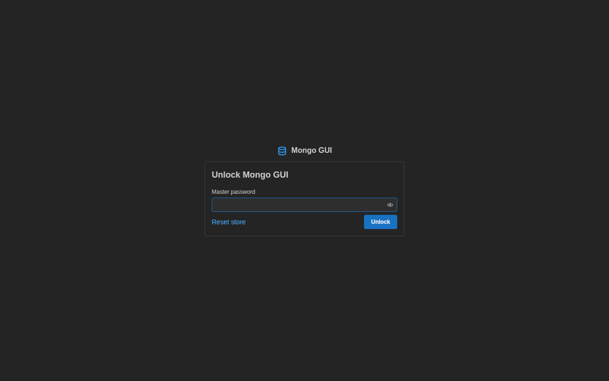 | 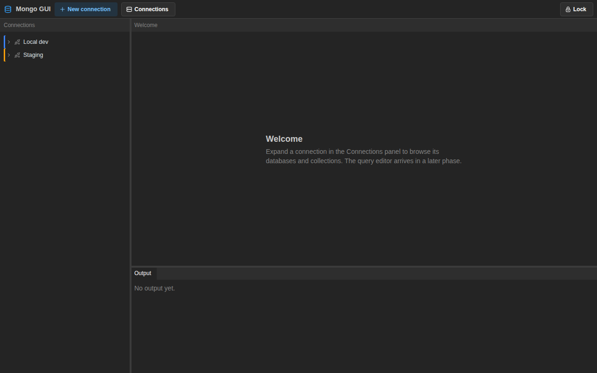 |

| Connection tree                                                                                  | Connection dialog                                                             |
| ------------------------------------------------------------------------------------------------ | ----------------------------------------------------------------------------- |
| 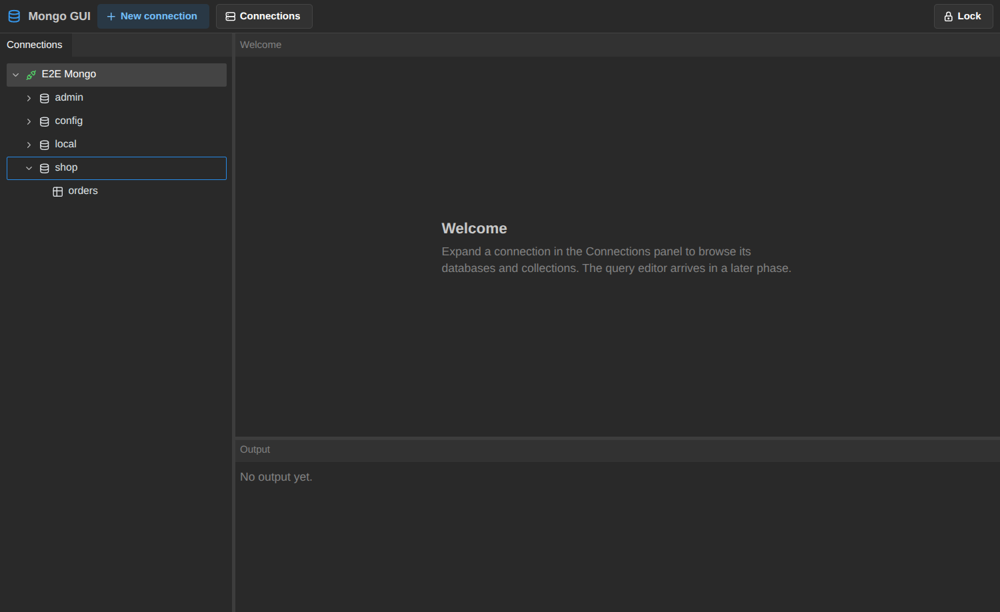 | 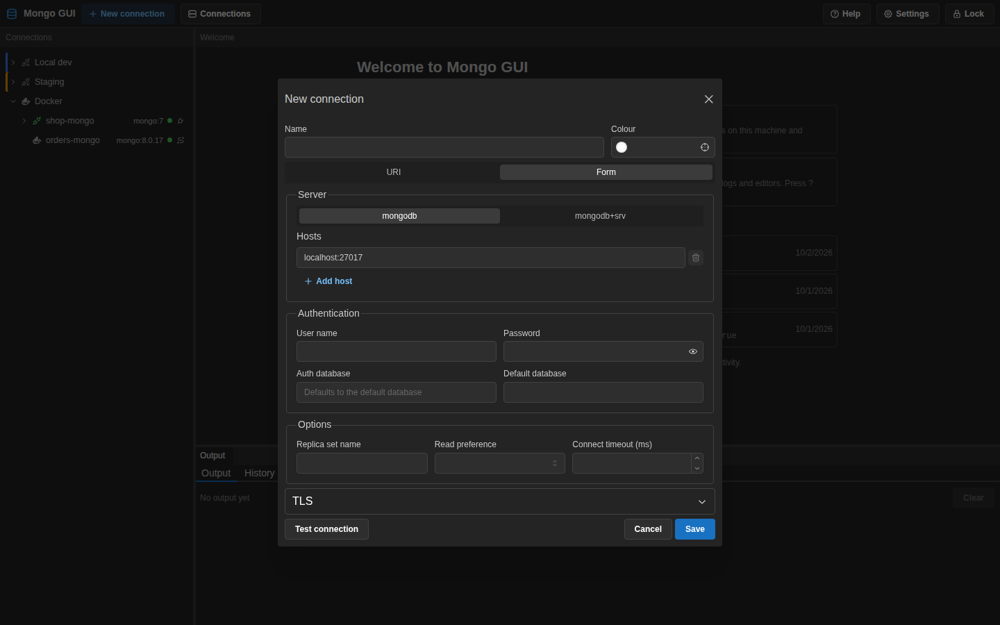 |

| Indexes with the create index dialog                                             | Validation with a Monaco validator                                                | Documents                                                                    |
| -------------------------------------------------------------------------------- | --------------------------------------------------------------------------------- | ---------------------------------------------------------------------------- |
| 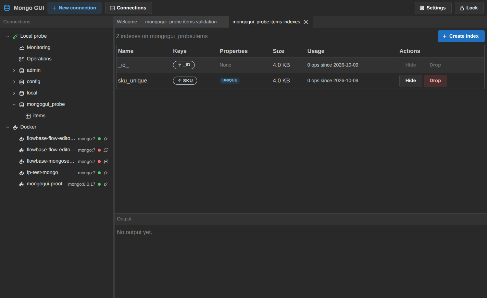 | 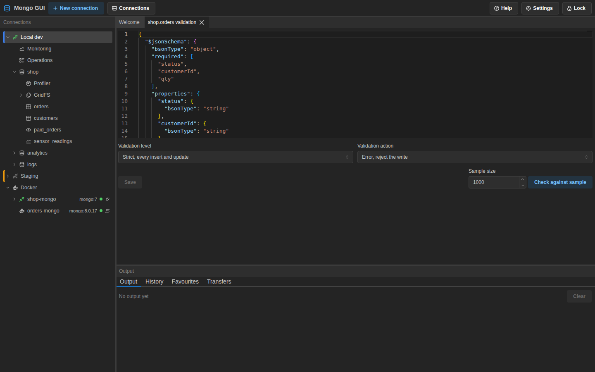 | 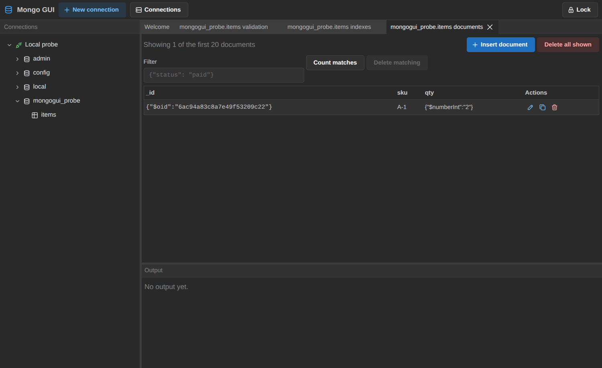 |

| Profiler                                                                               | Top query shapes                                                        |
| -------------------------------------------------------------------------------------- | ----------------------------------------------------------------------- |
| 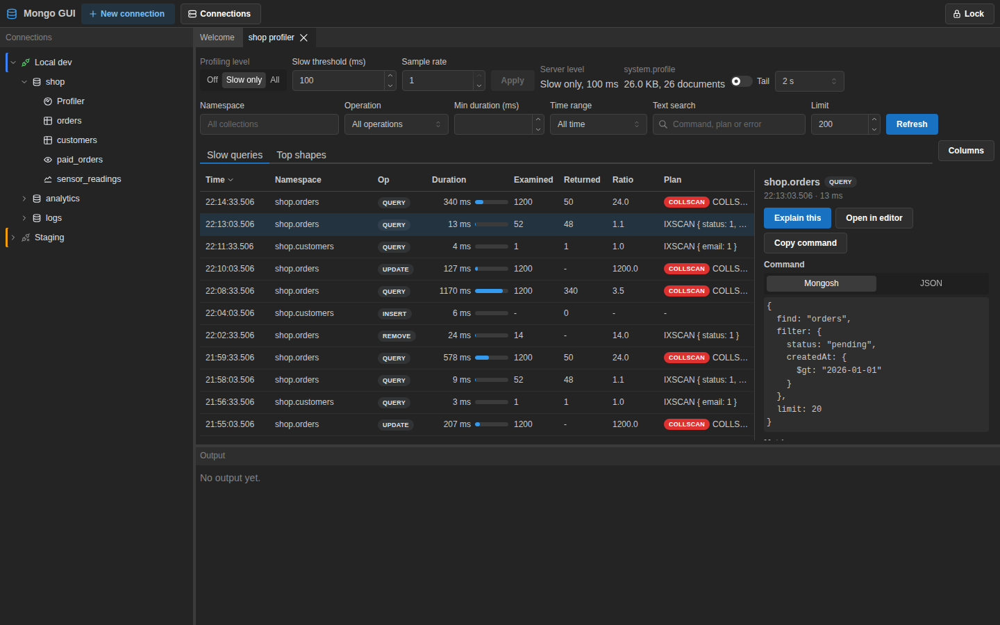 | 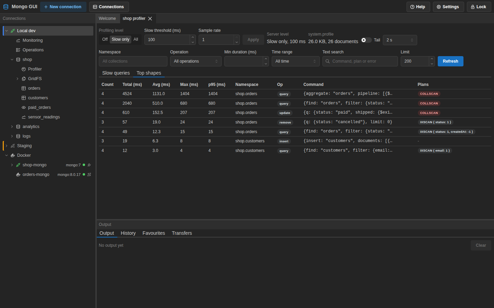 |

| Explain of a find with an in-memory sort warning                                               |
| ---------------------------------------------------------------------------------------------- |
| 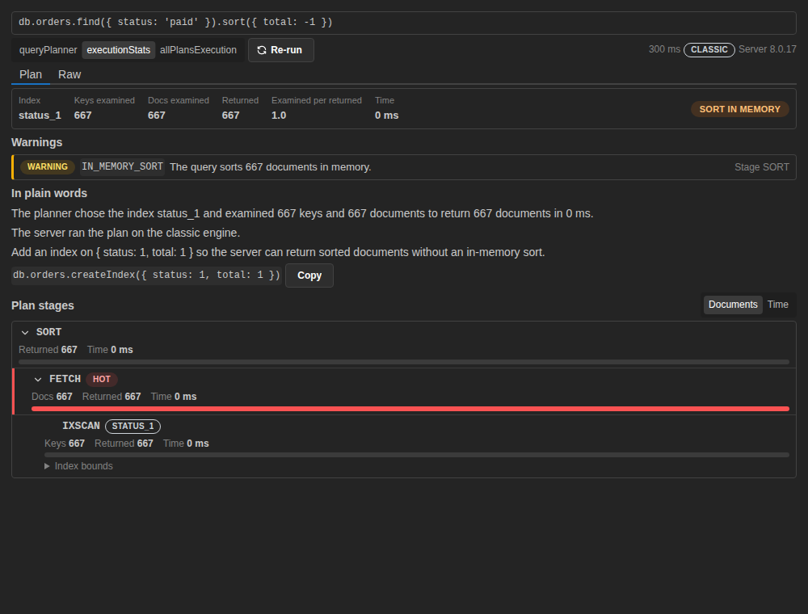 |

| Docker node in the connection tree                                                    |
| ------------------------------------------------------------------------------------- |
| 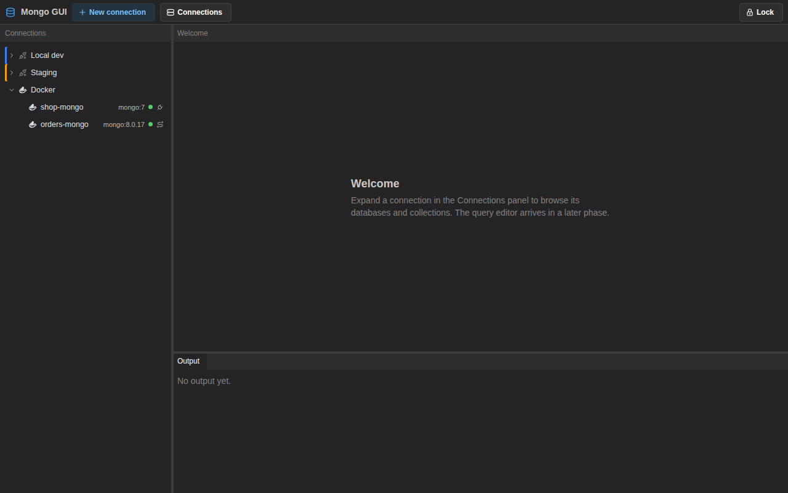     |
| Monitor dashboard                                                                     | Running operations                                                                         |
| ------------------------------------------------------------------------------------- | ------------------------------------------------------------------------------------------ |
| 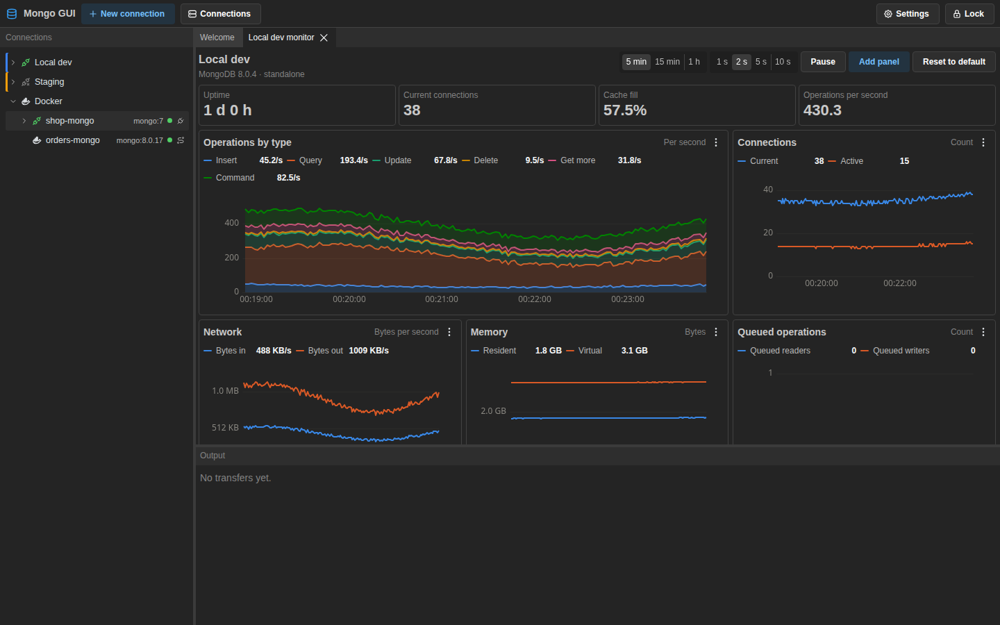 | 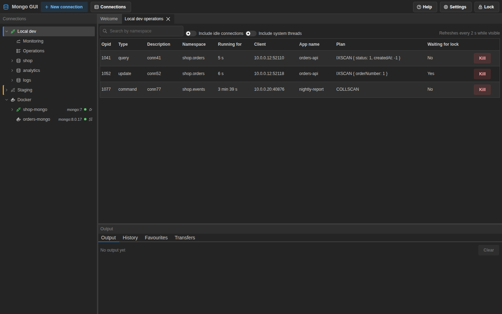 |

| Add panel picker, grouped by category                                                    |
| ---------------------------------------------------------------------------------------- |
| 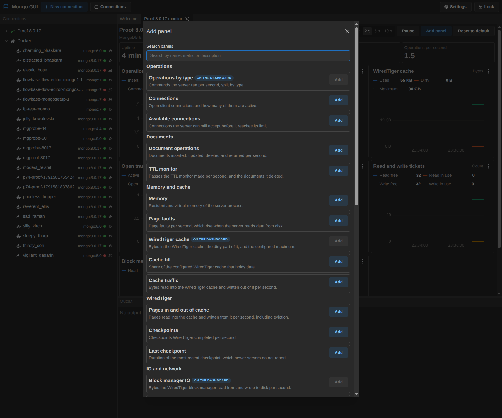 |

| Import wizard, preview and field mapping                                      | Export dialog                                                                     |
| ----------------------------------------------------------------------------- | --------------------------------------------------------------------------------- |
| 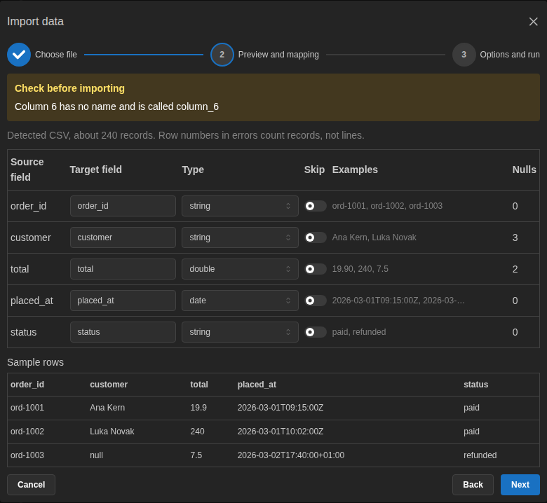 | 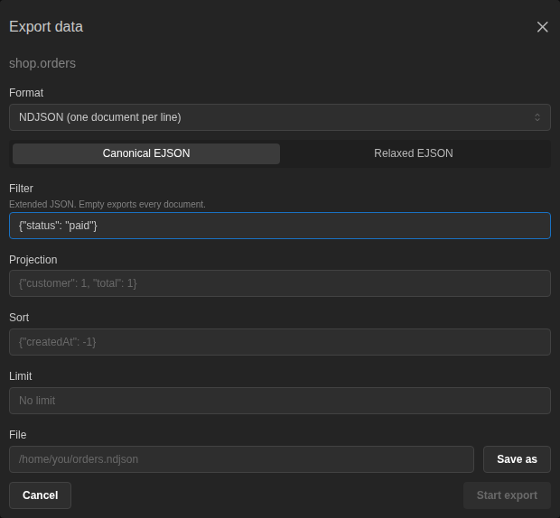 |

## Prerequisites

- Node.js 24 (see `.nvmrc`)
- pnpm 12

## Scripts

- `pnpm install` installs dependencies.
- `pnpm dev` starts the Electron app with hot reload (electron-vite in `packages/app`).
- `pnpm dev:ui` serves the UI in a browser against an in-memory mock backend. Add `?preset=unlocked` to the URL to start with fixture connections.
- `pnpm build` builds the Electron main, preload and renderer bundles into `packages/app/out`.
- `pnpm lint` runs ESLint over the repository.
- `pnpm typecheck` builds all TypeScript project references with `tsc -b`.
- `pnpm test` runs the unit tests.
- `pnpm test:integration` runs the integration tests against MongoDB 4.4, 6.0 and 8.0 in Docker through Testcontainers.
- `pnpm check` runs lint, typecheck and unit tests in that order.
- `pnpm storybook` opens the component stories for `packages/ui`.
- `pnpm format` rewrites files with Prettier. `pnpm format:check` only reports them.
- `pnpm dist` builds unsigned installers for the current platform into `packages/app/release`.

## Packaging and releases

`pnpm dist` builds the app and writes installers for the current platform to
`packages/app/release/`. It publishes nothing. Linux builds an AppImage and a `.deb`,
Windows builds an NSIS installer, and macOS builds a DMG and a ZIP for both x64 and arm64.

Releases come from CI. To release a version:

1. Bump `version` in `packages/app/package.json`, commit, and push.
2. Tag the commit and push the tag:

   ```sh
   git tag v0.1.0
   git push origin v0.1.0
   ```

The tag must match the version in `packages/app/package.json`. The `prepare` job stops the
release before any build starts if they differ.

The `prepare` job creates a draft GitHub Release for the tag. The builds on Ubuntu,
Windows and macOS then run in parallel and upload their installers to that draft. When all
three builds succeed, a final job marks the release public. If one build fails, the
release stays a draft, so users never see a partial set of files. Fix the failure and
re-run the failed job from the Actions page. The re-run adds its files to the same draft.

A manual run of the workflow from a branch builds the installers and keeps them as
workflow artifacts for seven days. A manual run from a tag ref behaves like a tag push: it
validates the version, publishes to the draft release, and marks it public.

The builds are unsigned for now. On Windows, SmartScreen shows "Windows protected your PC"
on the first run. Choose "More info", then "Run anyway". On macOS, the builds use ad-hoc
signing, which needs no certificate. Gatekeeper still refuses the first launch with a
"cannot verify the developer" dialog. Open System Settings, go to Privacy and Security,
and choose "Open Anyway". On Linux, no signature check applies. Run `chmod +x` on the
AppImage, or install the `.deb` with `apt install ./<file>.deb`.

Downloads appear on the [Releases page](https://github.com/eriksimonic/mongodb-mager/releases).

### Updates

The app checks GitHub for a new release about ten seconds after you unlock it, and then every
six hours. The check runs in the background and never delays startup. The setting lives in the
encrypted store, so the first check waits for the master password. A check that fails, for
example while the machine is offline, stays out of sight, and the app tries again on the next
schedule. An available update shows a notice in the toolbar with its version.

On the AppImage and the Windows installer, the app downloads the update when you choose
Download. When the download finishes, choose Restart to update. Choose Later to keep working,
and the update installs the next time you quit. On the `.deb` package and on macOS, the app
cannot replace itself. It shows the version and a Download from GitHub link, and you install
the new version by hand.

Turn off "Check for updates" in Settings to stop all checks. The app then makes no requests to
GitHub until you turn the setting back on.

## Documentation

The architecture, security model and task plan are in [docs/PLAN.md](docs/PLAN.md).

## License

MIT. See [LICENSE](LICENSE).
