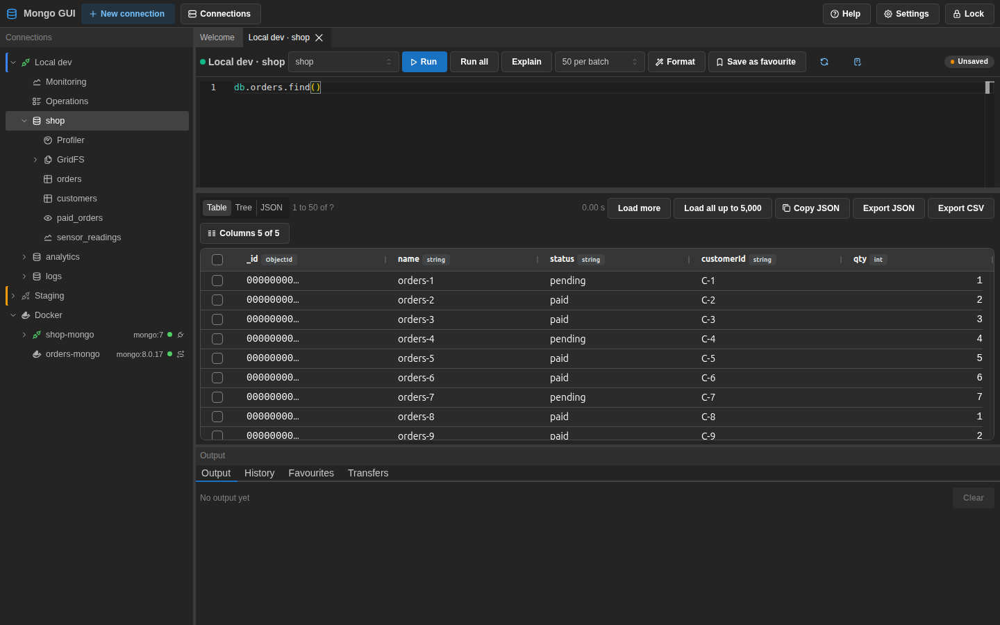
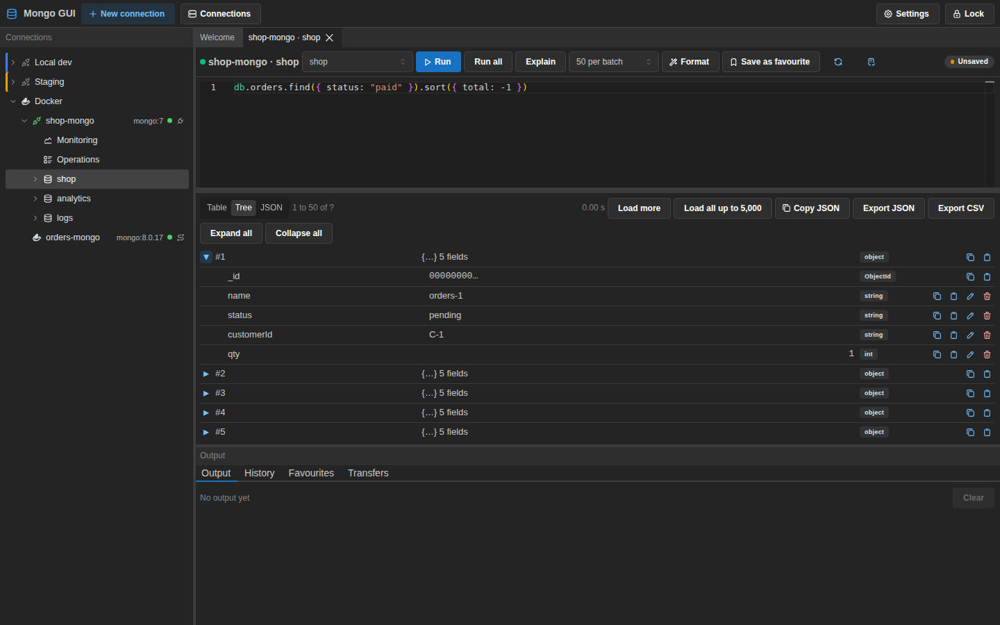
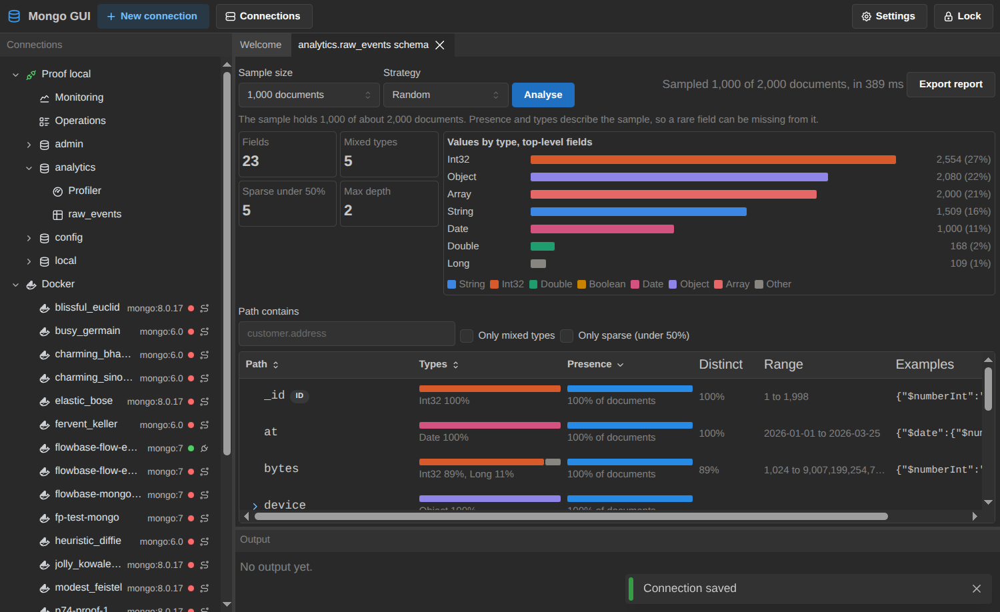
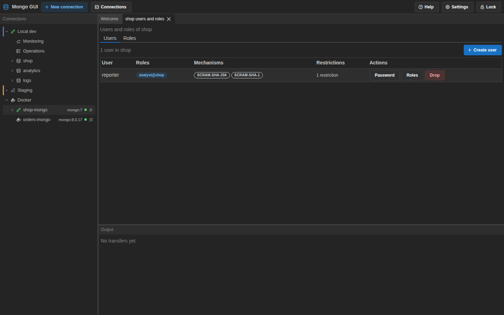
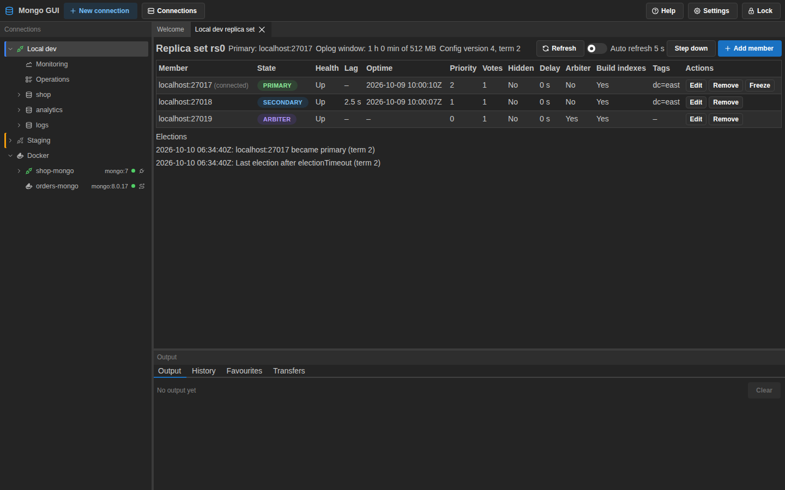
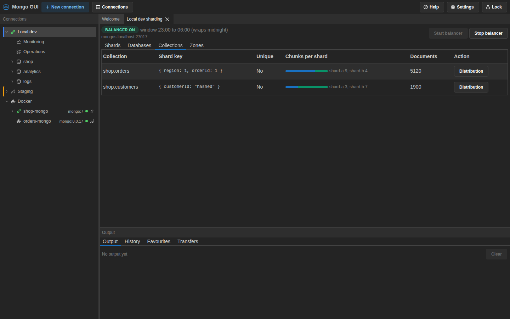
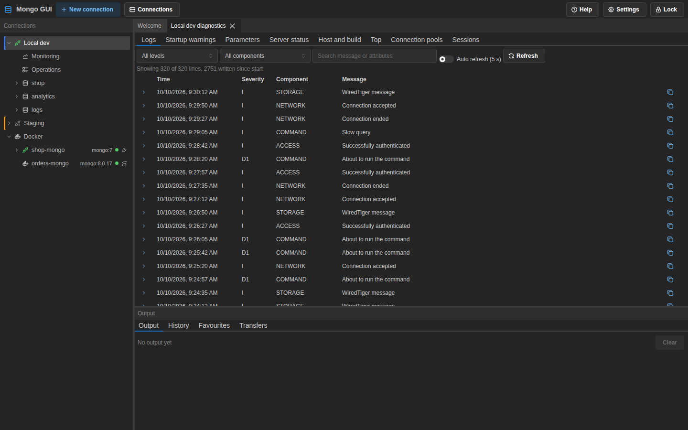
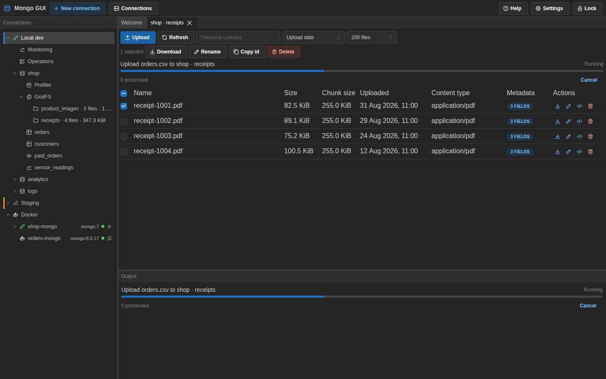
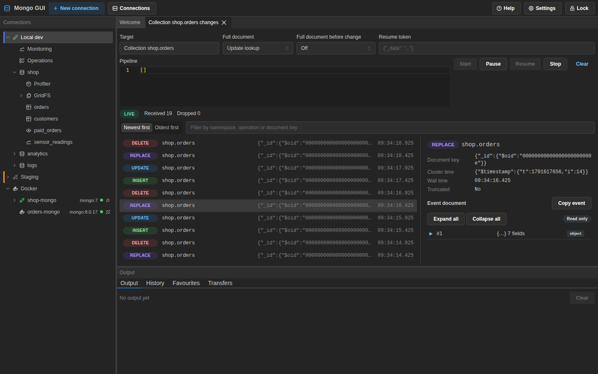

# User guide

This guide describes the Mongo GUI desktop app as shipped in version 0.1.0. Labels in
quotes are the text on the buttons, menus and fields.

## Contents

- [First launch and the master password](#first-launch-and-the-master-password)
- [Connections](#connections)
- [Docker discovery](#docker-discovery)
- [The connection tree](#the-connection-tree)
- [The editor](#the-editor)
- [Results](#results)
- [Explain](#explain)
- [Collection management](#collection-management)
- [Monitoring](#monitoring)
- [Profiler](#profiler)
- [Import and export](#import-and-export)
- [Schema analysis](#schema-analysis)
- [Users and roles](#users-and-roles)
- [Replica set](#replica-set)
- [Sharding](#sharding)
- [Diagnostics](#diagnostics)
- [GridFS](#gridfs)
- [Change streams](#change-streams)
- [Settings and appearance](#settings-and-appearance)
- [Updates](#updates)

## First launch and the master password

The app stores saved connections, query history, favourites and settings on disk. A master
password encrypts all of them. The password never leaves your machine, and the app keeps no
copy of it. See [security.md](security.md) for the details.

On the first launch, the app shows the first-run screen.

1. Type a master password in "Master password". The password must have at least 10 characters.
2. Type the same password in "Confirm master password". The strength meter shows how strong the
   password is.
3. Click "Create vault".

Every later launch shows the unlock screen before any other content.

1. Type the master password in "Master password".
2. Click "Unlock". A wrong password shows "The master password is incorrect." Each failed
   attempt waits half a second before the app checks again.

Keep the master password safe. The app cannot recover it. A forgotten password means the
stored data cannot be read again. To start over, use "Reset store" on the unlock screen. Type
`DELETE` in the confirmation field and click "Delete store". The reset deletes every saved
connection, history entry, favourite and setting.

The app locks itself after a period without activity. The default is 30 minutes. Change it
under "Idle lock (minutes)" in Settings, in the Security section. To lock the app at once,
use one of these:

- Click "Lock" in the toolbar.
- Press Ctrl+L, or Cmd+L on macOS.
- Open Settings and click "Lock now".

Locking closes every open connection and clears the key from memory.

To change the master password, open Settings, go to Security, and click "Change master
password". Type the current password, then the new password twice. The app re-wraps its key
under the new password. It does not rewrite your data.

## Connections

### Create a connection

1. Click "New connection" in the toolbar. The dialog opens in form mode.
2. Type a name in "Name". Pick a colour in "Colour" to tell connections apart in the tree.
3. Fill in the fields described below, or switch the "Connection string mode" control to
   "URI" and paste a connection string.
4. Click "Test connection". The result line reports the server version and the topology, or
   the error from the server.
5. Click "Save".

The form mode has these fields:

- "Scheme" chooses `mongodb` or `mongodb+srv`.
- "Hosts" lists one or more hosts. Click "Add host" to add a row. Each row has a host name and
  port. Use `localhost:27017` for a local server.
- "Default database" and "Auth database".
- "User name" and "Password".
- "Replica set name" for a replica set.
- "Read preference" with a list of the standard read preferences.
- "Connect timeout (ms)" for how long the app waits before it gives up.
- "Use TLS" turns TLS on. When it is on, "Allow invalid certificates" skips certificate
  checks, and "CA file path" and "Client certificate file path" name the files to use.

The URI mode accepts a `mongodb://` or `mongodb+srv://` string. The app splits the string into
the form fields when you switch back to form mode. A malformed string shows a message instead.

Connection strings with a password are stored encrypted. The app never shows a stored password
in logs or in the tree. Context menus copy the URI with the password masked.

### Connect

1. Find the connection in the tree, or open the "Connections" panel from the toolbar.
2. Right-click the connection and choose "Connect". You can also select the row and press
   Enter.

The tree shows the server's databases once the connection opens. Choose "Disconnect" from the
same menu to close it.

### Connection manager

The "Connections" button in the toolbar opens the connection manager. It lists every saved
connection with two icon buttons for each row. The "Edit" button opens the connection dialog. The
"Delete" button opens a "Remove connection" confirmation. Removing a connection also deletes its saved
query history.

## Docker discovery

The app can find MongoDB containers on the local machine. The Docker node appears in the
connection tree. When the app cannot reach the Docker Engine, the node shows the reason.

The app lists a container in two cases. The container uses one of these images: `mongo`,
`mongodb/*`, `bitnami/mongodb` or `percona/percona-server-mongodb`. Or the container exposes
port 27017. The list includes stopped containers. Each container row shows its name, image tag and
state. The list refreshes every 10 seconds. A stopped container does not accept a connection, so
start it first.

To connect to a container, select its row and press Enter, or choose "Connect" from its menu.
The app uses these routes:

- A container that publishes port 27017 connects through the host port.
- A container that does not publish port 27017 connects through a forwarder. The app starts
  a small `alpine/socat` container on the same Docker network. The forwarder publishes a free
  loopback port and relays traffic to the MongoDB container. The app labels the forwarder
  `mongo-gui.forwarder`. It removes the forwarder when you disconnect, when you quit the app,
  and when it starts. The app pulls the forwarder image when the machine does not have it.

If the container sets `MONGO_INITDB_ROOT_USERNAME` and `MONGO_INITDB_ROOT_PASSWORD`, the app
fills in the user name and password for you.

The right-click menu on a container offers "Open container details" and "Copy URI (redacted)".
The details panel lists the container id, image, networks and environment variable names. It
does not show their values.

Requirements:

- Docker Engine running on the machine. On Linux and macOS, the app uses `/var/run/docker.sock`.
  On Windows, it uses the `docker_engine` named pipe. A `DOCKER_HOST` value that starts with
  `unix://` takes precedence on Linux and macOS.
- Read access to the socket. On Linux, add your user to the `docker` group and sign in again.
- A way to pull the `alpine/socat` image when a container needs a forwarder.

Turn on "Connect Docker instances automatically" in Settings to connect to every discovered
container when the app starts. The setting is off by default.

## The connection tree

The left panel shows the connections. Each connected server has these nodes:

- Databases. Expand a database to see its collections, views and time series collections.
- Profiler. Opens the profiler.
- GridFS. Lists the buckets of a database.
- Monitoring. Holds two rows. "Monitoring" opens the monitor dashboard, and "Operations" opens
  the list of running operations.

Keyboard use in the tree:

1. Press Up and Down to move between rows.
2. Press Right to expand a node, and Left to collapse it.
3. Press Home and End to jump to the first or last row.
4. Press Enter to connect or open the selected row.
5. Press Shift+F10, or the context menu key, to open the menu for the row.

Right-click a database or collection to see its menu. The collection menu offers these items:

- "Open documents" opens an editor tab with `db.<collection>.find({})` and runs it.
- "Manage documents" lists the documents in the Documents panel.
- "Indexes" and "Validation" open the matching panels.
- "Analyse schema" opens the schema panel.
- "Import data" and "Export data" open the transfer dialogs.
- "Watch changes" opens a change stream.
- "Collection stats" opens the stats panel.
- "Shard collection" opens the shard dialog, on a sharded cluster.
- "Rename", "Clear" and "Drop" change the collection. Each one asks for confirmation.
- "Refresh" reloads the node.

Double-click a collection to open the same query tab as "Open documents". A collection name that
is not a plain identifier, such as `daily-totals`, runs as `db.getCollection("daily-totals").find({})`.
If the active tab on the same connection is empty, the query replaces its text. Otherwise the query
opens a new tab.

The database menu offers "Open editor", "New collection", "Import data into new collection",
"Open profiler", "Watch changes", "Users and roles", "New GridFS bucket", "Database stats",
"Drop database" and "Refresh".

The connection menu offers "Connect", "Disconnect", "Monitor", "Watch changes", "Sharding",
"Replica set", "Diagnostics", "Users and roles", "Open editor", "New database", "Edit", "Refresh"
and "Remove".

## Tabs

The centre area holds dock tabs for the editors, documents, indexes and other panels. Right-click
a tab to open its menu. "Close" closes the tab, as its close button does. "Close others" closes
the other tabs in the same group. "Close tabs to the left" and "Close tabs to the right" close the
tabs on that side in the group, and their items are off when no tab lies on that side. "Close all
tabs" closes every tab. The connections, welcome and output panels never close from this menu.

## The editor

Open an editor from a database. Choose "Open editor" from the database menu, or press Ctrl+N
with a database selected. Each editor tab belongs to one connection and one database. The
toolbar shows the database. Change it in the "Database" select.

Type mongosh statements into the editor. The editor offers completion for collection names,
field names and operators as you type. It also shows signature help for operators.

To run statements:

1. Put the cursor on a statement and press Ctrl+Enter, or click "Run". The app runs the
   statement under the cursor. If you select text first, the app runs the selection.
2. Press Ctrl+Shift+Enter, or click "Run all", to run the whole text of the editor. A script can
   call `print`. Output appears in the Output panel.
3. Click "Cancel" to stop a running statement. The app closes the cursor it holds.
4. Click "Explain" to show the plan of the statement under the cursor. See [Explain](#explain).

Other toolbar controls:

- "Batch size" sets how many documents each page holds. The choices are 20, 50, 100 and 500.
- "Format" reformats the text.
- "Save as favourite" saves the statement with a name and a folder.
- "Refresh databases" reloads the database list. "Refresh field names" reloads the fields that
  completion uses. The app samples documents to find the fields.

The Output panel under the editor has four tabs: "Output", "History" and "Favourites", and
"Transfers". Every statement you run goes into "History". Search the history with the
"Search history" field, or filter it by connection or database. Re-run an entry to run it again.
"Clear history" deletes all history entries after confirmation. Favourites holds the saved
statements. Use "Save as favourite" in the editor or in the history to add one.

The app keeps the text of each open editor tab, and the tab list. The tabs come back the next
time you open the app.

To export the result of the last run, use the results pane. See [Results](#results).

## Results

The results pane shows the documents of the last run. Switch between three views with the
"Result view" control: "Table", "Tree" and "JSON".

- Table view shows one column for each field. The "Columns" menu chooses which columns show.
  Nested fields appear as dotted paths.
- Tree view shows each document as an expandable tree. Each value has a type badge. "Collapse
  all" folds the tree. Each row has "Copy path" and "Copy value" buttons.
- JSON view shows the result as read-only mongosh-style text.

Paging:

1. The first batch loads with the size you chose in "Batch size".
2. Click "Load more" to load the next batch.
3. Click "Load all up to 5,000" to load up to 5,000 documents at once.

Editing values in tree view:

1. Use the "Edit value" control on a value in tree view.
2. Pick the BSON type in the type control. A type badge shows the type of each value.
   Types include ObjectId, Decimal128, Long, Date and binary.
3. Click "Save value" to write the change, or "Cancel edit" to discard it.

Copy and export:

- "Copy JSON" copies the result. If you select rows, the button reads "Copy N as JSON" and
  copies only those rows.
- "Export JSON" and "Export CSV" write the result to a file. The app opens a save dialog, and
  it writes only to the file you pick. JSON export keeps every BSON type in canonical EJSON.

## Explain

Open an explain from the editor with "Explain", or from a profiler entry with "Explain this".
The panel has two tabs. "Plan" shows the plan as a tree. "Raw" shows the document that the
server returned.

Use the "Verbosity" control to choose how much the server reports:

- `queryPlanner` shows the plan without running the query.
- `executionStats` runs the query and shows counts and timings for each stage.
- `allPlansExecution` runs the query and also reports the candidate plans.

The summary row shows the index used, keys examined, documents examined, documents returned,
the ratio of examined to returned documents, and the time.

The plan tree shows one row for each stage. Each stage has an icon and a category. The
categories are scan, fetch, filter, sort, projection, limit, lookup, group, merge, sharding,
text, geo, write, cache, express and unknown. Hover over a stage to read what it does and
which metrics apply to it.

The panel adds warnings and advice below the tree. Examples include a collection scan, an
in-memory sort, a stage that spilled to disk, and a ratio of examined to returned documents
above 10 to 1. A "Rejected plans" section lists the plans the planner dropped. Click "Compare"
on a rejected plan to see it next to the winning plan.

The "Raw" tab shows the explain document as canonical EJSON. Use "Search raw output" with
"Next match" and "Previous match" to find text. "Copy" copies the document.

## Collection management

### Databases and collections

- In the tree, right-click a server and choose "New database" from the menu, or create a
  database from the Databases node. The dialog asks for "Database name" and "Initial
  collection name". Click "Create database".
- Right-click a database and choose "New collection". The dialog asks for "Collection name" and
  options:
  - "Capped collection" with "Size in bytes" and "Maximum documents".
  - "Time series collection" with "Time field", "Meta field", "Granularity" and "Expire after
    seconds".
  - "Clustered by _id".
  - "Collation as EJSON", "Validator as EJSON", "Validation level" and "Validation action".
    Click "Create collection".
- Right-click a collection and choose "Rename". Type "New collection name" and click "Rename".
- Choose "Drop" on a collection. The dialog asks you to type the collection name before "Drop
  collection" becomes available. "Drop database" on a database asks for the database name the
  same way.
- Choose "Clear" to delete every document and keep the collection and its indexes. This
  action asks for confirmation but not a typed name.

### Indexes

Open the "Indexes" panel from the collection menu.

1. Read the list. Each index shows its keys, with an arrow for ascending or descending order,
   and its usage counts from `$indexStats`.
2. Click "Create index" to open the index builder.
3. Add a field with the field row controls. For each field, choose the order and type.
4. Set the options you need: "Index name", "Expire after seconds (TTL)", "Unique", "Sparse",
   "Hidden", "Text weights", "Default language", "Partial filter expression as EJSON",
   "Collation as EJSON" and "Wildcard projection as EJSON".
5. Check the "createIndexes command preview" at the bottom of the dialog.
6. Click "Create index".

To drop an index, choose "Drop index" and type the index name. Choose "Hide" or "Unhide" to
change whether the planner may use an index. Hiding an index keeps it in place.

### Validation

Open the "Validation" panel from the collection menu. It shows the JSON schema validator of
the collection in an editor.

1. Edit the validator.
2. Choose the "Validation level": "Off", "Moderate, existing invalid documents are skipped" or
   "Strict, every write".
3. Choose the "Validation action": "Warn, log and accept" or "Error, reject the write".
4. Set "Sample size" and click "Check against sample" to test the validator on sample
   documents.
5. Click "Save".

### Documents

Choose "Open documents" from the collection menu to run `find({})` in an editor tab. Choose
"Manage documents" to open the "Documents" panel.

- Type a filter in "Filter". "Count matches" counts the documents the filter matches.
- "Load more" fetches the next page.
- Each row has "Edit document", "Duplicate document" and "Delete document" controls.
- Click "Insert document" to add a document. The editor takes EJSON text.
- "Delete matching" deletes every document that matches the filter. The button reads "Delete N
  matching" once you have counted the matches. "Delete all shown" deletes only the rows on the
  screen. Both ask for confirmation.

## Monitoring

Open the "Monitor" panel from the connection menu, or from the Monitoring node in the tree.
The dashboard charts server metrics in panels. Each panel shows one group of metrics, such as
operations per second, connections, memory, the WiredTiger cache or replication lag.

Panel controls:

1. Click "Add panel" to open the picker. Panels are grouped by category. Type in "Search
   panels" to filter them.
2. Use the menu on a panel card to change it. "Move left" and "Move right" reorder the panels.
   "Width" sets 1, 2 or 3 columns. "Height" sets "Standard" or "Tall". "About this panel"
   explains the metric. "Close panel" removes the panel.
3. Drag a panel by its handle to move it. The handle has the tooltip "Drag to move this panel".
4. Click "Reset to default" to restore the default panels.

The sampling interval is in the dashboard header. The choices are 1 s, 2 s, 5 s and 10 s. The
layout is saved for each connection. If the app cannot save the layout, it shows "The
dashboard layout is not saved".

The Operations panel lists the operations that run on the server. Open it from the Monitoring
node in the tree.

1. Type part of a namespace in "Search by namespace". Tick "Include idle connections" or
   "Include system threads" to show those rows.
2. Click the "Kill operation" button on a row to stop an operation. The app asks for
   confirmation first.

## Profiler

Open the profiler from the database menu with "Open profiler". The profiler has two tabs:
"Slow queries" and "Top shapes".

1. Choose a "Profiling level" for the database: "Off", "Slow only" or "All".
2. Set "Slow threshold (ms)" and click "Apply". The server records operations slower than this
   threshold when the level is "Slow only".
3. Use the filters to narrow the list. The filters cover the namespace, the operation, the
   minimum duration in "Min duration (ms)", and a time range. The time range options are
   "Last 5 min", "Last 15 min", "Last hour", "All time" and "Custom".
4. Turn on "Tail" to read new entries as they arrive. "Tail poll interval" sets how often the
   app checks, from 0.5 s to 10 s.
5. Select an entry to read its command, plan summary and lock statistics in the detail pane.
   "Explain this" opens an explain of the command. "Open in editor" opens the command in an
   editor. "Copy command" copies it.
6. Open "Top shapes" to see the query shapes that take the most time. Click a shape to filter the
   slow queries to that shape.

## Import and export

### Import

Open the import wizard from a collection with "Import data". To import into a collection that
does not exist, choose "Import data into new collection" from the database menu. The wizard
has three steps: "Choose file", "Preview and mapping" and "Options and run".

1. Click "Browse" and pick a file. Choose the "Format": "Detect from the file", "JSON array",
   "NDJSON (one document per line)" or "CSV".
2. Check the preview. The app infers the type of each field. Adjust the field mapping in the
   table when a type is wrong.
3. Choose the import options. For CSV, these include "First row is a header" and the
   "Delimiter". Choose "Stop at the first error" to stop on the first bad row. Choose the
   "Mode": "Insert new documents", or "Replace documents that match the upsert key, or insert
   them". The upsert mode needs an "Upsert key".
4. Click "Start import". The progress view shows the processed, inserted, updated and failed
   counts. Click "Cancel" to stop the import.
5. Click "Open collection" to see the result, or "Import another" to start over.

### Export

Choose "Export data" on a collection.

1. Choose the "Format": "JSON array", "NDJSON (one document per line)" or "CSV".
2. Set the query: "Filter", "Projection", "Sort" and "Limit".
3. For CSV, set "Arrays and objects" and the "Delimiter". "Write as JSON text" keeps each array
   as JSON text in one cell. "Join scalar items with a comma" joins scalar items in one cell.
4. Click "Save as" and pick the file. The app writes only to the file you pick.
5. Click "Start export". The progress view shows the count. Click "Show in folder" when it
   finishes.

The file rules are these:

- The app reads an import file only after you pick it in a file dialog.
- The app writes an export only to a path you pick in a save dialog. It never overwrites a file
  you did not pick.
- A pick covers one write. A refused write needs a new pick.
- The app refuses a path that contains `..`, and a path that is a symbolic link.

## Schema analysis

Open "Analyse schema" from the collection menu.

1. Set "Sample size" in documents.
2. Choose the sampling strategy: "Random", "First by _id" or "Last by _id".
3. Click "Analyse".

The panel shows a summary, a bar for each type, and a table of fields. Each field row shows its
path, types, presence as a percentage, null values and examples. Filter the table with "Path
contains" and "Only mixed types".

Each field has an "Actions for" menu with three items:

- "Create index on this field" opens the index builder with the field filled in.
- "Add to validation rule" adds a rule for the field to the validator. Save the validator to keep
  the rule.
- "Find documents where this field is missing" copies a query to the clipboard. Paste it into an
  editor to list the documents.

Click "Export report" to copy the report.

## Users and roles

Open "Users and roles" from the database or connection menu. The panel has two tabs.

The "Users" tab lists the users of the database. Create a user with "Create user". The dialog asks
for a user name, a password and its confirmation, the authentication mechanisms ("SCRAM-SHA-256"
or "SCRAM-SHA-1") and the roles to grant. For a user, the roles dialog offers "Grant roles" and
"Revoke roles", and "Apply" saves the change. "Change password" sets a new password. "Drop user"
asks you to type the user name.

The "Roles" tab lists built-in and custom roles. Create a role with the role editor. The
privilege editor takes a resource, which is the cluster, a database, a collection or any
resource. It then takes the actions for that resource, grouped by category. "Remove privilege"
removes a row. "Drop role" asks you to type the role name.

The app disables a control that the signed-in user cannot use, and the tooltip gives the
reason. For example, the tooltip reads that the signed-in user cannot create or drop users on the
database.

Revoking a role that lets you manage users can lock you out. The app asks you to tick "I
understand that I may lose the right to manage users" before it saves that change.

## Replica set

Open "Replica set" from the connection menu. The panel shows the members of the set.

The members table shows each member's host, state, health, lag, priority, votes, hidden flag,
delay, tags and arbiter flag. The panel also shows the oplog window and the list of elections.

Actions on a member:

1. "Step down" on the primary opens a dialog with a "Seconds" field. Set the seconds and click
   "Step down". The panel offers this action only when you connect to the primary.
2. "Freeze" stops a member from becoming primary for the number of seconds you set.
3. "Edit" changes the priority, votes, hidden flag, delay and tags. The dialog shows a preview
   with "Preview change". Click "Apply" to save the change.
4. "Remove" takes a member out of the set. Type the set name, then click "Apply".

To add a member, click "Add member". Enter the host and the member's options. Use "Build
indexes" to build indexes on the new member. Preview the change, then click "Apply".

Every change to the configuration uses a version bump. If the change would lose the quorum of the
set, the app refuses it and says why. The panel shows "This change is refused" in that case.

To start a set on a standalone server that runs with `--replSet`, choose "Initiate replica set".
Type the set name and click "Initiate". The panel reads "No replica set yet" when the server has no
set.

## Sharding

Open "Sharding" from the connection menu. The panel has four tabs: "Shards", "Databases",
"Collections" and "Zones".

- The header shows the balancer state, "Balancer on" or "Balancer off". "Start balancer" and
  "Stop balancer" change it.
- The "Databases" tab lists each database with its primary shard. "Enable sharding" turns on
  sharding for a database.
- The "Collections" tab lists the sharded collections, with the shard key and the chunk count per
  shard. "Distribution" shows the chunk layout of a collection.
- To shard a collection, choose "Shard collection" from the collection menu. Choose the shard key
  and the options "Unique" and "Presplit hashed zones". Click "Apply" after the summary shows
  the change. The dialog asks you to type the namespace before "Apply" becomes available.

On a server that is not a sharded cluster, the panel shows "Not a sharded cluster".

## Diagnostics

Open "Diagnostics" from the connection menu. The panel has these tabs: "Logs", "Startup
warnings", "Parameters", "Server status", "Host and build", "Top", "Connection pools" and
"Sessions".

- "Logs" shows the server log. Filter it by level, by component and by text in "Search log".
- "Parameters" lists the server parameters. Search them by name.
- "Server status" shows the `serverStatus` output as a tree. Search the tree.
- "Host and build" shows the host name, the operating system and the server build.
- "Top" lists the time spent in each collection since the server started.
- "Connection pools" shows the pools of the connection, with the connections in use and
  available.
- "Sessions" lists the sessions. Choose "Kill" on a session to end it. "Kill all sessions of"
  a user asks you to type the user name first.

To read the statistics of one collection, choose "Collection stats" from the collection menu.
The panel lists the document count, data size, average document size, storage size, index count
and index size.

## GridFS

Each database has a GridFS node in the tree. Open a bucket from that node.

1. Click "New GridFS bucket" in the database menu, type a "Bucket name", and confirm.
2. Click "Upload file" and pick a file. When a file with the same name exists, the app asks
   "Replace existing file?". Choose "Skip", "Replace" or "Replace all", or click "Stop".
3. Search the file list with "Filename contains". The search matches any part of the name.
   "Sort by" orders the list by "Upload date", "Name" or "Size".
4. Select a file to open its drawer. The drawer offers "Download", "Rename" and "Edit metadata".
   "Delete" removes the file after confirmation.
5. Select several files with the checkboxes. The "Selection actions" menu deletes them together.

A download writes only to a folder or a file that you pick in a dialog. "Edit metadata" opens the
metadata as JSON text. Saving replaces the whole metadata object. "Drop bucket" asks you to type
the bucket name.

## Change streams

Open a change stream with "Watch changes". Choose it from a collection, a database or the
connection menu. The menu on a connection watches the whole deployment.

1. Read the "Target" field. It shows the collection, database or deployment.
2. Set "Full document" for updates. Set "Full document before change" to include the document
   before an update or delete. The options depend on the server version.
3. Type an aggregation pipeline in "Change stream pipeline". The pipeline filters the events on
   the server.
4. Type a resume token in "Resume token" to start after a known event.
5. Click "Start". The event list fills as events arrive.
6. Click "Pause" to stop the list from updating. Click "Resume" to continue.
7. Type in "Filter events" to narrow the list. "Event order" puts the newest or oldest events
   first.
8. Select an event to read it in the detail pane. "Copy event" copies the event. "Copy token"
   copies its resume token. "Resume from here" starts a new stream after that event.
9. Click "Clear" to empty the list.

Closing the panel stops the stream.

## Settings and appearance

Open Settings with the "Settings" button in the toolbar, or with Ctrl+, on Windows and Linux, or
Cmd+, on macOS. The screen has these sections:

- Appearance. "Dark", "Light" or "System" set the theme. "Editor font size" sets the editor font.
  "Compact" or "Comfortable" sets the density.
- Security. "Idle lock (minutes)", "Change master password" and "Lock now".
- Connections. "Connect Docker instances automatically".
- Updates. "Check for updates".
- Data. "Sample size (documents)" sets how many documents schema analysis reads. "History limit
  (entries)" sets how many history entries the app keeps.
- Data, "Export connections". Select the connections to write, then type a passphrase of at least
  10 characters and confirm it. The app opens a save dialog, and it writes an encrypted file there.
  The passphrase belongs to this file. You need it to import the file, and the app cannot recover
  it. The file holds the credentials of the connections you selected, so store it as carefully as
  the passwords themselves.
- Data, "Import connections". The app opens a file dialog. Choose a file from "Export connections",
  type its passphrase and click "Read file". The table lists each connection with its host, its
  auth kind and whether the name is already in use. Then choose what happens to a name that exists:
  "Import as copies" adds a number to the name, "Skip connections whose name exists" leaves the
  existing connection alone, and "Replace the existing connection" overwrites it. Click "Import".
  The result line gives the counts, and the connection tree reloads.
- About. The version, the project page and the licence.

The layout of panels and the window size are saved. The next launch opens where you left off.

To read the keyboard shortcuts, choose "Keyboard shortcuts" from the "Help" menu in the toolbar,
or press Shift+?. See [shortcuts.md](shortcuts.md) for the full list.

## Updates

The app checks GitHub for a new release about 10 seconds after you unlock it, and then every six
hours. A failed check does not show an error. The check waits for the vault, so it runs after
you unlock. An available update shows a notice in the toolbar with its version. The notice has
these buttons: "Download", "Download from GitHub", "Restart to update", "Later", "Dismiss" and
"Release notes".

What happens next depends on the platform:

1. On the AppImage and the Windows installer, click "Download". The app downloads the update in
   the background. When the download finishes, click "Restart to update" to install it now, or
   "Later" to install it when you quit.
2. On the `.deb` package and on macOS, the app cannot replace itself. Click "Download from
   GitHub" and install the new version by hand.

Turn off "Check for updates" in Settings to stop every check. The app makes no requests to GitHub
while the setting is off.
